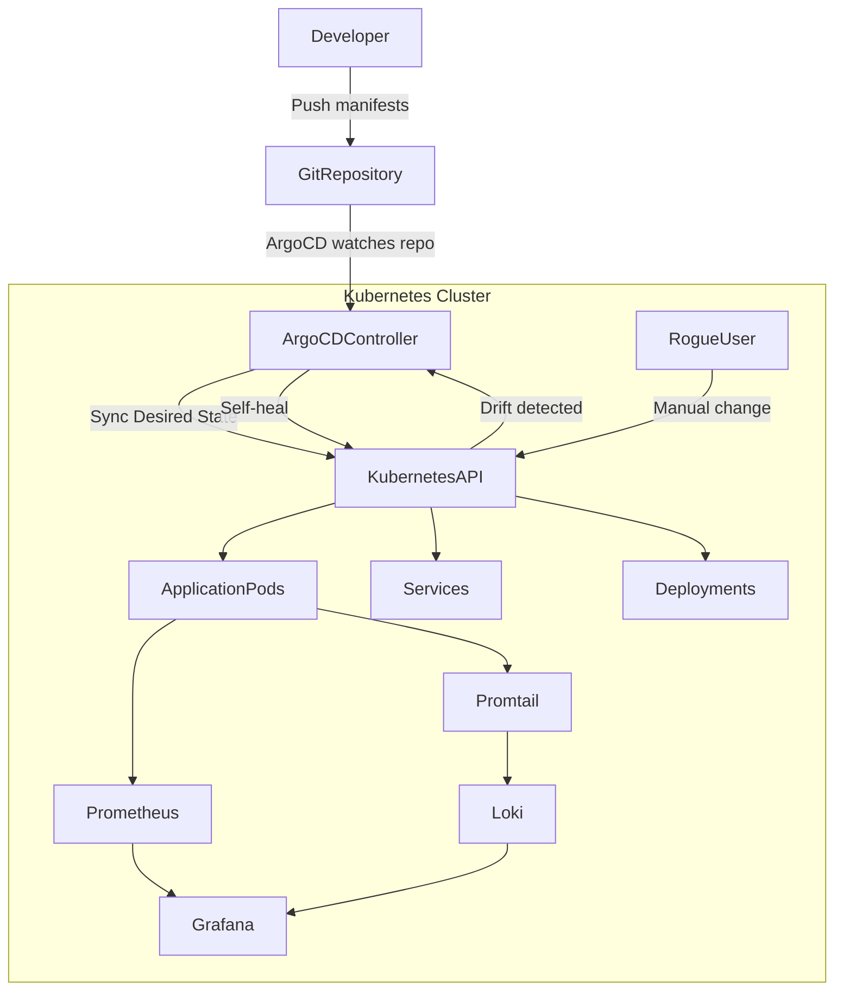

# 🐙 Self-Healing GitOps Infrastructure with ArgoCD

This project demonstrates a **production-style GitOps platform** built using **Kubernetes + ArgoCD + Observability tools**.

The goal of this project is to build a **self-healing Kubernetes infrastructure** where the **desired state of the cluster is stored in Git**, and any manual change made to the cluster is **automatically reverted by ArgoCD**.

The repository acts as the **single source of truth** for the entire infrastructure and application stack.

---

# 📌 Key Features

This project demonstrates several **modern DevOps practices**:

* GitOps workflow using **ArgoCD**
* **Self-healing Kubernetes infrastructure**
* **App-of-Apps pattern**
* **Declarative infrastructure**
* **Kustomize overlays for multi-environment deployments**
* **Monitoring with Prometheus & Grafana**
* **Centralized logging with Loki & Promtail**
* **Drift detection and automatic reconciliation**

---

# 🏗️ Architecture Blueprint

The architecture follows a strict **GitOps model** where the cluster continuously synchronizes with the Git repository.



---

# 🔁 GitOps Workflow

The workflow of this project is:

1. A developer pushes Kubernetes manifests to Git.
2. ArgoCD continuously monitors the Git repository.
3. ArgoCD compares:

```
Desired State (Git)
vs
Live State (Kubernetes)
```

4. If differences are detected:

```
ArgoCD synchronizes the cluster.
```

5. If someone manually changes the cluster:

```
kubectl edit
kubectl scale
kubectl delete
```

ArgoCD automatically restores the **Git state**.

This behavior is known as **Self-Healing Infrastructure**.

---

# 📂 Repository Structure

This repository follows an **industry-grade GitOps repository layout**.

```
gitops-platform-demo
│
├── infrastructure
│   │
│   ├── argocd
│   │     └── root-app.yaml
│   │
│   ├── argocd-apps
│   │     ├── my-app.yaml
│   │     ├── prometheus.yaml
│   │     └── loki.yaml
│   │
│   ├── monitoring
│   │     ├── prometheus
│   │     └── grafana
│   │
│   └── logging
│         ├── loki
│         └── promtail
│
└── apps
      └── my-self-healing-app
            │
            ├── base
            │     ├── deployment.yaml
            │     ├── service.yaml
            │     └── kustomization.yaml
            │
            └── overlays
                  ├── dev
                  └── prod
```

---

# 🧠 Key Concepts Used

## App-of-Apps Pattern

ArgoCD manages applications through a **root application**.

```
Root App
   │
   ├── Application workloads
   ├── Monitoring stack
   └── Logging stack
```

The **Root App** deploys all other applications automatically.

---

## Kustomize

Kustomize allows us to avoid YAML duplication.

```
base/
   common manifests

overlays/
   environment-specific configuration
```

Example:

```
dev → 1 replica
prod → 3 replicas
```

---

# 📊 Observability Stack

A **complete observability stack** is included in this project.

## Monitoring

### Prometheus

Prometheus collects metrics from:

* Kubernetes nodes
* Pods
* ArgoCD controller
* Applications

Example metrics:

```
CPU usage
Memory usage
Pod restart count
Deployment health
```

---

### Grafana

Grafana visualizes metrics collected by Prometheus.

Dashboards include:

* Cluster health
* Pod resource usage
* ArgoCD sync status
* Deployment metrics

---

## Logging

### Loki

Loki aggregates logs from Kubernetes pods.

Example logs:

```
Application logs
ArgoCD logs
Container logs
```

---

### Promtail

Promtail runs as a **DaemonSet**.

It collects logs from:

```
/var/log/pods
/var/log/containers
```

and sends them to **Loki**.

---

# 🚀 How the System Bootstraps

Bootstrapping a new cluster requires only **two commands**.

---

## Step 1 — Install ArgoCD

Create namespace

```
kubectl create namespace argocd
```

Install ArgoCD

```
kubectl apply -n argocd -f https://raw.githubusercontent.com/argoproj/argo-cd/stable/manifests/install.yaml
```

---

## Step 2 — Deploy Root Application

```
kubectl apply -f infrastructure/argocd/root-app.yaml
```

This triggers the **App-of-Apps cascade deployment**.

ArgoCD automatically deploys:

```
Application workloads
Prometheus monitoring
Grafana dashboards
Loki logging stack
```

---

# 🔑 Access ArgoCD UI

Port-forward ArgoCD server

```
kubectl port-forward svc/argocd-server -n argocd 8080:443
```

Open

```
https://localhost:8080
```

Get admin password

```
kubectl -n argocd get secret argocd-initial-admin-secret -o jsonpath="{.data.password}" | base64 -d
```

---

# 🛡️ Testing the Self-Healing Mechanism

To test the GitOps self-healing behavior, manually change the cluster.

Example:

```
kubectl scale deployment my-self-healing-app --replicas=0
```

Now watch the pods:

```
kubectl get pods -w
```

ArgoCD detects the drift and automatically restores the deployment to the state defined in Git.

Result:

```
replicas restored automatically
pods recreated
```

---

# 📈 Monitoring the System

Grafana dashboards allow you to visualize:

```
Cluster health
Application performance
ArgoCD synchronization
Resource usage
```

Prometheus also generates alerts for:

```
Pod failures
High CPU usage
Deployment failures
```

---

# 🧾 Logging and Audit Trail

Using Loki and Promtail you can track:

```
Application logs
ArgoCD sync logs
Cluster events
```

This helps in debugging **self-healing events** and tracking unauthorized changes.

---

# 📌 Technologies Used

```
Kubernetes
ArgoCD
GitOps
Kustomize
Prometheus
Grafana
Loki
Promtail
Docker / Kind
kubectl
```

---

# 🎯 What This Project Demonstrates

This project showcases several **modern DevOps and SRE practices**:

* Infrastructure as Code
* GitOps automation
* Self-healing infrastructure
* Kubernetes application management
* Observability and monitoring
* Drift detection and automated reconciliation

---

# 🏁 Conclusion

This repository demonstrates how to build a **fully automated GitOps platform** where:

```
Git = source of truth
ArgoCD = automation engine
Kubernetes = execution platform
Prometheus/Grafana/Loki = observability
```

Together these components create a **robust, observable, and self-healing infrastructure platform**.

---

# 📚 Future Improvements

Possible extensions of this project include:

* Service Mesh with **Istio**
* CI/CD integration using **GitHub Actions**
* Secret management with **External Secrets**
* Multi-cluster GitOps
* Canary deployments